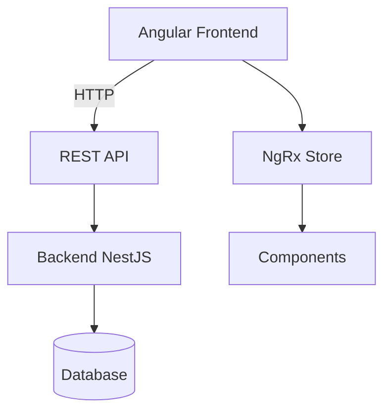
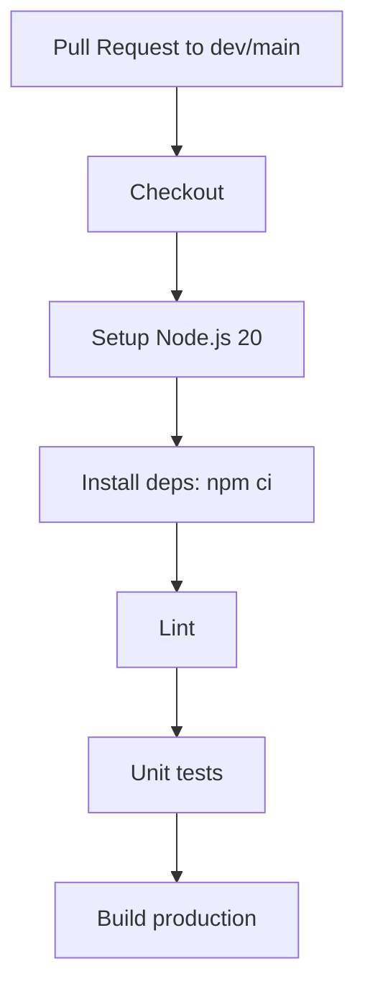
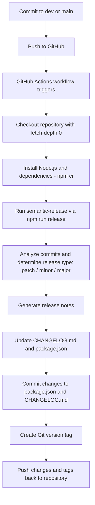

# RS-Clone Movie DB

Angular Final Project 2025  
Task: https://github.com/rolling-scopes-school/tasks/tree/master/angular/modules/rsclone

## Project Description

**Movie DB** is a full-stack web application that allows users to manage their personal movie database.  
Users can register or log in (via email/password or Google), search for movies through the TMDb API, view detailed movie pages, and create personal collections such as favorites, watched, or "to watch".  
Custom lists and user libraries make it easy to organize and track everything you watch.

## Technology Stack

Angular 20,  
RxJS, Signals,  
TypeScript,  
Netlify (CD),  
GitHub Actions (CI),  
ESLint, Prettier, Husky.

## Installation & Run

> > Описать развёртывание Бэка

```bash
git clone https://github.com/exact84/RS-Clone.git
npm install
npm start
```

Open http://localhost:4200 in the browser.

## Available Scripts

npm start - start local dev server at http://localhost:4200  
npm run build - development build  
npm run build:prod - production build  
npm run lint - run ESLint  
npm run lint:fix - lint with auto-fix  
npm run prettier - format code with Prettier  
npm run prepare - install husky,  
npm run test - run unit tests  
npm run test:ci - run unit tests in headless mode (for CI)  
npm run watch - rebuild in watch mode

## Environment Variables

Create a .env file in the project root:

API_URL=https://api.example.com
...

> > Описать все переменные окружения

## Architecture

#### Main components:

Frontend (Angular) — SPA client  
Backend (NestJS) — API for authentication and user data  
TMDb API — external movie database integration  
User DB — favorites, watched, custom lists

> > Тут всё описать все модули что получаться в итоге, можно со схемой взаимодействия



## CI/CD

### CI (Continuous Integration):

- GitHub Actions run lint, unit tests (test:ci), and production build (build:prod) on each push and pull request into dev or main branches.


CD (Continuous Deployment):

- Netlify automatically deploys the latest `dev` branch to the production environment.
- For each Pull Request, Netlify creates a **Deploy Preview** — a temporary live environment to test changes before merging.

### Changelog pipeline

The workflow updates the changelog, version in package.json and git tag
based on commit messages and previous tag.

In the repository settings, you need to enable the parameter:
Settings → Actions → General → Workflow permissions → “Read and write permissions”
Add the token to GitHub Secrets as `NPM_TOKEN`.



## Short rationale:

> > in README (5–7 lines) explain where you chose signals vs RxJS and why (clarity, perf, simplicity). (10 pts)

## Performance budget

> > in README + measured Lighthouse gains. (20 pts)

```

```
