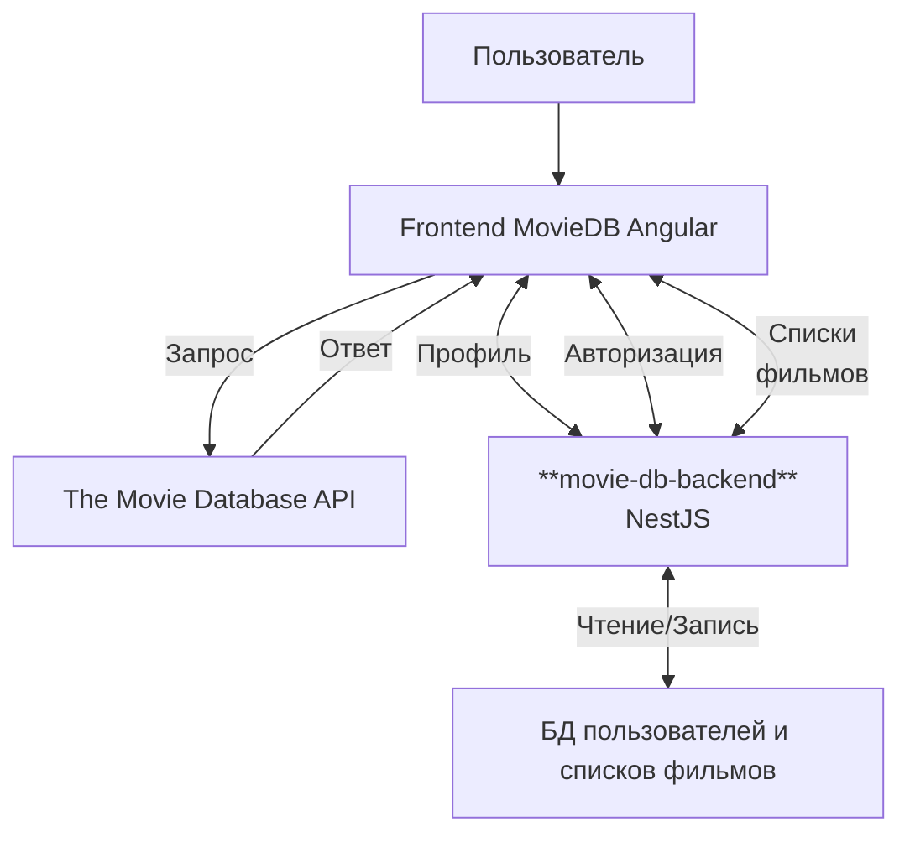
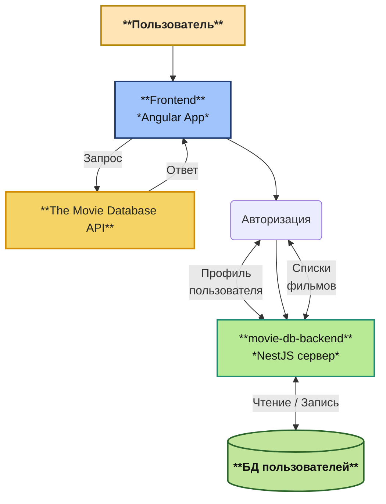

```mermaid
flowchart TD
    A[Пользователь]
    A -->B[Frontend MovieDB Angular]
    B -->|Запрос| C[The Movie Database API]
    C -->|Ответ| B
    D <-->|Чтение/Запись| E[БД пользователей и списков фильмов]
    B <-->|Профиль| D
    B <-->|Авторизация| D[    **movie-db-backend**<br>NestJS]
    B <-->|Списки<br>фильмов| D
```

```mermaid
flowchart TD
    A[**Пользователь**]:::user
    B[**Frontend**<br>*Angular App*]:::frontend
    C[**The Movie Database API**]:::api
    D[**movie-db-backend**<br>*NestJS сервер*]:::backend
    E[(**БД пользователей**)]:::db
    F(Авторизация)

    A --> B
    B -->|Запрос| C
    C -->|Ответ| B
    B --> F
    F <-->|Профиль<br>пользователя| D
    F --> D
    D <-->|Чтение / Запись| E
    F <-->|Списки<br>фильмов| D

    %% Стили
    classDef user fill:#ffe4b5,stroke:#b8860b,stroke-width:2px,color:#222,font-weight:bold;
    classDef frontend fill:#a1c4fd,stroke:#1e3c72,stroke-width:2px,color:#111;
    classDef api fill:#f6d365,stroke:#d68c00,stroke-width:2px,color:#222;
    classDef backend fill:#b8e994,stroke:#218c74,stroke-width:2px,color:#111;
    classDef db fill:#c2e59c,stroke:#2c662d,stroke-width:2px,color:#111,font-weight:bold;

    %% Кликабельные ссылки
    click C "https://developer.themoviedb.org/reference/intro/getting-started" "Открыть TMDb Docs"
    click D "https://nestjs.com/" "Документация NestJS"
```

