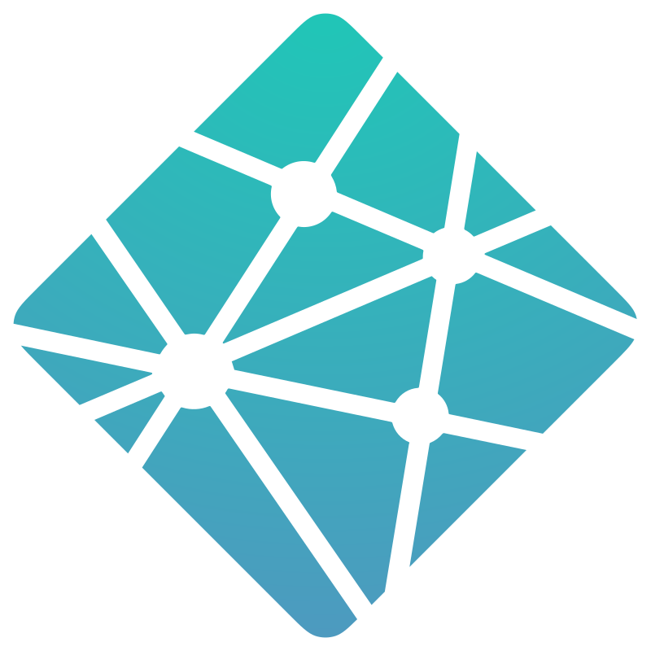
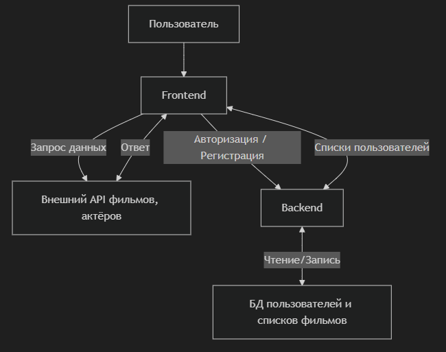
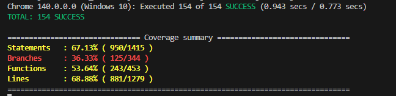
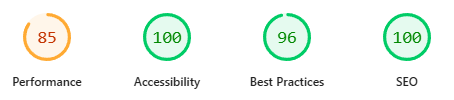
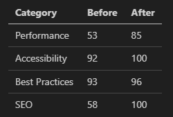

Требования: https://github.com/rolling-scopes-school/tasks/blob/master/angular/modules/peresentation/README-RU.md

# **План презентации**

## **1. Титульный слайд**

Angular Final Project 2025 **RS-Clone Movie DB**

Команда: _Angular Masters_

Логотипы  
 

**<u>Речь:</u>**  
> Здравствуйте, мы команда Angular Masters.  
> Сегодня представим наш финальный проект — Movie DB, веб-приложение
> позволяющее пользователям управлять своей личной базой данных фильмов.
> Пользователи могут зарегистрироваться или войти в систему, смотреть
> списки, искать фильмы через API TMDb, просматривать подробные страницы
> фильмов и актёров, создавать персональные коллекции, такие как
> «Избранное», «Просмотрено» или «Хочу посмотреть».

## **2. Команда**

- Evgeniia Korolova — Страницы: Home, Movies, People. Копоненты: Header,
  Menu.

- Nikolay Makarevich — Backend. Страницы: Auth, Profile, а так же
  Routing, Guards.

- Alexey Trukhlyayev — Team Lead, CI/CD, Error monitoring, Deploy.
  Страницы: Filters, Search, Footer

> **<u>Речь:</u>**  
> У нас в команде три человека. Евгения отвечала за основные страницы и навигацию. Николай разработал бэкенд и авторизацию. Я занимался организацией, пайплайнами, деплоем и частью страниц.
> 
> Мы выстроили процесс максимально близкий к реальной разработке.
> 
> Для управления задачами использовали GitHub Projects в формате Kanban-доски. Каждый таск оформлялся как Issue и проходил все этапы — от To Do до Done.
> 
> Работу синхронизировали через регулярные чаты в Discord, где обсуждали прогресс и проблемы. Перед ключевыми этапами проводили финальные обсуждения.
> 
> Весь код проходил через pull requests и обязательный код-ревью — это помогало держать единый стиль и вовремя находить ошибки.
> 
> Таким образом, у нас получилось командное взаимодействие, похожее на рабочий процесс в реальных проектах.

## **3. Цель и описание проекта** _(может вообще исключить?)_

- Цель: создать SPA для управления персональной базой фильмов.

- Ключевые возможности: регистрация пользователей, просмотр списков по
  категоирям, поиск фильмов через TMDb API, просмотр карточки фильма,
  формирование и просмотр коллекций («избранное», «смотреть позже»).

**<u>Речь:</u>**  
> Цель проекта — сделать удобный интерфейс для работы с фильмами, включая авторизацию, фильтрацию/поиск и личные коллекции.

## **4. Архитектура проекта**

*структура кода, модули и компоненты* - не очень понимаю что требуется тут.

Диаграмма:

- Frontend: Angular SPA

- Backend: NestJS API

- TMDb API

- User DB

**<u>Речь:</u>**  
> Архитектура типична для full-stack приложений: Angular SPA работает с
> внешним TMDb API для фильмов и с нашим NestJS бэкендом для авторизации
> и пользовательских данных.

## **5. Технологии и стек**

- Angular 20 + TypeScript

- RxJS + Signals

- NgRx Signals (глобальное состояние)

- NestJS (бэкенд)

- Netlify + GitHub Actions

- ESLint, Prettier, Husky

- Semantic-release

**<u>Речь:</u>**  
> Мы использовали Angular 20 с TypeScript, чтобы проектировать приложение с жёсткой типизацией.
> 
> Для работы с асинхронными потоками применяли RxJS, а для управления локальным и глобальным состоянием — Signals и NgRx Signals.
> 
> Бэкенд мы реализовали на NestJS.
> 
> Для процессов CI/CD мы настроили GitHub Actions - чтобы автоматически прогонять линтинг, тесты и сборку на каждом пуше. А развертывание приложения настроили через Netlify — это позволило нам получить автодеплой и превью каждой ветки.
> 
> Кроме того, мы следили за качеством кода с помощью ESLint, форматировали его через Prettier, а за Git-хуки отвечал Husky.
> 
> Использвали Semantic-release, чтобы автоматически обновлять версию приложения и генерировать changelog.
> 
> В результате команда работала в едином стиле, чтобы проект — оставался стабильным и удобным для дальнейшей поддержки.

## **6. Управление состоянием**

- **RxJS** → API и асинхронные потоки.

- **toSignal()** → преобразование потоков в удобное состояние (мост между RxJS и сигналами).

- **signal()** → локальное управление состоянием UI.

- **NgRx Signals** → глобальное состояние (профиль, избранное).

**<u>Речь:</u>**  
> Мы использовали несколько подходов к управлению состоянием.
> 
> RxJS отвечает за API и асинхронные операции. Сервисы возвращают Observables, которые мы обрабатываем через switchMap, map, catchError.
> 
> Чтобы удобнее использовать данные прямо в шаблонах, мы преобразуем Observables в Signals через toSignal. Так нам не нужны подписки и async пайпы.
> 
> Для локального состояния — загрузка, фильтры, ошибки — мы используем signal(). Это делает интерфейс отзывчивым и избавляет от лишних подписок.
> 
> Для глобального состояния, например профиля и избранного, мы применили NgRx Signals. Это позволило централизованно управлять сложными сценариями и синхронизацией данных.

## **7. CI/CD**

- GitHub Actions: lint → тесты → билд

- Netlify: deploy + deploy preview

- Semantic release: автоматический changelog, версии, теги

**<u>Речь:</u>**  
> Мы настроили полноценный пайплайн.
> 
> - При создании PR запускается линтинг, юнит-тесты и билд.
> - Netlify деплоит preview для каждой ветки.
> - При пуше в dev, Netlify деплоит prod, Semantic release изменяет версию и changelog.

## **8. Демонстрация**

- Регистрация / логин.

- Разделы главной страницы.

- Поиск фильмов.

- Movies по категориям.

- Filter.

- Страница фильма.

- Коллекции.

- Страница профиля.

**<u>Речь:</u>**  
> Сейчас мы покажем основные функции. **_(перейти на деплой)_**

## **9. Тестирование и качество кода**

- Unit tests (Jasmine + Karma)

- ESLint + Prettier + Husky (pre-commit и pre-push hooks)

- Обязательный код-ревью каждого PR

**<u>Речь:</u>**  
> Мы внедрили юнит-тесты на Jasmine и Karma, чтобы проверять основные сценарии работы приложения.
> 
> Линтинг и автоформатирование настроили через ESLint и Prettier, а Husky следил за Git-хуками.
> 
> Каждый pull request обязательно проходил code review.
> 
> Все эти проверки запускались автоматически в CI через GitHub Actions — это помогало держать код чистым и единообразным. (перейти в репо на список PR)

## **10. Netlify деплой**

- Deploy previews на PR и Автодеплой при мерже PR

- Netlify-функции для секретов для API_KEY

**<u>Речь:</u> _(показать в коде)_**  
> Для деплоя фронтенда мы используем Netlify.  
> При каждом мёрже в ветку dev автоматически разворачивается продакшн-версия.  
> Кроме того, Netlify создаёт Deploy Preview для каждого pull request, и мы можем сразу протестировать изменения в живом окружении, ещё до мержа.
> 
> Чтобы не хранить секреты в клиентском коде, мы используем Netlify Functions. Через них происходит доступ к ключам API, например к API_KEY от TMDb. Таким образом, ключ никогда не попадает в браузер пользователя.

## **11. Error Monitoring**

- Sentry интеграция

- Пример captureException

**<u>Речь:</u>**  
> Для мониторинга ошибок мы подключили **Sentry**.  
> Если в приложении возникает ошибка, она автоматически отправляется на сервер Sentry, где мы можем отследить стек вызовов и быстро найти проблему.

---

## **12. Оптимизация и производительность**

Lighthouse результаты

таблица Before/After

**<u>Речь:</u>**  
> Мы улучшили производительность с 53 до 85 баллов в Lighthouse, уменьшив размер картинок, изменив способ загрузки картинок, добавив раздел optimization в angular.json

## **13. Проблемы и решения**

- CI/CD пайплайны → решали экспериментами и помощью ментора
- Различия Linux/Windows → контейнеризация + хостинг бэкенда
- Signals (новая технология) → изучение документации + практика

**<u>Речь:</u>**  
> Основные сложности у нас были в трёх направлениях.
> 
> Первое — настройка CI/CD пайплайнов. Мы много раз перепробовали разные конфигурации, обращались за помощью опытного ментора.
> 
> Второе — кроссплатформенность. На Linux и Windows бэкенд вёл себя по-разному. Решили это контейнеризацией и использованием развернутого бэкенда на хостинге.
> 
> Третье — новизна Signals. Для нас это был первый опыт. Мы решили учиться на практике: разбирались по документации и сразу пробовали в проекте.

## **14. Что улучшить** *(убрать?)*

- Улучшить покрытие тестами

- Добавить рекомендации фильмов

- *Что-то ещё*

**<u>Речь:</u>**  
> В будущем мы хотим расширить тестовое покрытие, добавить рекомендации
> и оптимизировать загрузку ресурсов.

## **15. Выводы и навыки**

- Работа с Angular 20 и Signals

- Настройка CI/CD, Netlify, semantic release

- Full-stack взаимодействие (NestJS + Angular + TMDb API)

  **<u>Речь:</u>**  
> Проект дал нам опыт работы с современным Angular, Signals и CI/CD пайплайнами. А также взаимодействия фронтенда и бэкенда.

## **16. Q&A**

- GitHub repository: https://github.com/exact84/RS-Clone

- GitHub Project: https://github.com/users/exact84/projects/1

- Netlify deploy: https://rs-clone.netlify.app/

  **<u>Речь:</u>**  
> Спасибо за внимание.  
> Готовы ответить на вопросы!  
